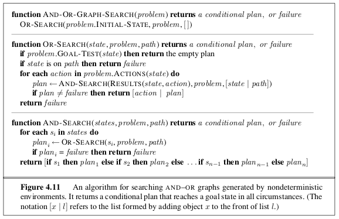

## Agentes inteligentes

Para cada una de las siguientes afirmaciones, indica si es verdadera o falsa y justifica tu respuesta con un ejemplo o un contraejemplo cuando sea apropiado.

1. Un agente que percibe solo información parcial sobre el estado no puede ser perfectamente racional.
2. Existen entornos en los que ningún agente reflejo puro puede comportarse de manera racional.
3. Existe un entorno en el que todo agente es racional.
4. La entrada de un programa de agente es la misma que la entrada de la función del agente.
5. Toda función de agente es implementable por alguna combinación de programa y máquina.
6. Supón que un agente selecciona su acción de manera uniforme al azar del conjunto de acciones posibles. Existe un entorno determinista en el que este agente es racional.
7. Es posible que un agente dado sea perfectamente racional en dos entornos distintos.
8. Todo agente es racional en un entorno no observable.

## Árboles de decisión

Construye un *conjunto de datos* (un conjunto de ejemplos con atributos y clasificaciones) que haga que el algoritmo de aprendizaje de árboles de decisión genere un árbol de tamaño no mínimo.

1. Crea el conjunto de datos con atributos y clasificaciones de tal manera que el algoritmo de árboles de decisión construya un árbol que no sea de tamaño mínimo.
2. Muestra el árbol de decisión construido por el algoritmo.
3. A continuación, muestra el árbol de decisión de tamaño mínimo que puedas generar a mano, basado en el mismo conjunto de datos.

## Búsquedas (más allá de A*)

En algunos problemas de búsqueda, especialmente aquellos que involucran decisiones contingentes (como en entornos no deterministas o con múltiples posibles resultados), se utilizan grafos AND-OR en lugar de los árboles de búsqueda tradicionales. A diferencia de los árboles estándar, donde cada nodo representa una decisión y conduce a una única rama, en los grafos AND-OR:

- Un nodo OR representa una elección entre varias acciones posibles. El agente necesita seguir solo una de las ramas.
- Un nodo AND representa una situación en la que todas las subramas deben tener éxito para que el plan sea exitoso (por ejemplo, cubrir todos los resultados posibles de una acción no determinista).

Estos grafos permiten representar planes condicionales o compuestos que deben tener en cuenta múltiples escenarios posibles. El objetivo de una búsqueda en un grafo AND-OR es encontrar un subplan que garantice el éxito sin importar las contingencias. 

El algoritmo de búsqueda en grafos AND-OR, que se muestra en la Figura \ref{fig:AND-OR}, verifica los estados repetidos solo en el camino desde la raíz hasta el estado actual. Supón que, además, el algoritmo almacenara todos los estados visitados y los comparara con esa lista. Familiarízate con el algoritmo y entiende los grafos AND-OR, posiblemente tendrás que consultar en los libros.

{#fig:AND-OR width=100%}

Determina qué información debería almacenarse y cómo debería usar esa información el algoritmo cuando se encuentre un estado repetido. (Sugerencia: será necesario distinguir al menos entre los estados para los cuales se construyó previamente un subplan exitoso y aquellos para los que no se pudo encontrar ningún subplan). Explica cómo usar etiquetas para evitar tener múltiples copias de subplanes.

## Satisfacción de restricciones

Considera el problema de recubrir *completamente y exactamente* una superficie con $n$ fichas de dominó (rectángulos de 2×1). La superficie es una colección arbitraria de $2n$ cuadrados de $1 \times 1$ que están *conectados por sus bordes* (es decir, adyacentes por al menos un lado, no solo por una esquina). Algunos ejemplos son: un tablero de ajedrez completo, un tablero con algunos cuadrados faltantes, una fila de 10×1 cuadrados, etc.

1. Formula este problema con precisión como un **problema de satisfacción de restricciones (CSP)** en el que **las fichas de dominó son las variables**.

2. Formula este problema con precisión como un **CSP en el que los cuadrados son las variables**, manteniendo el espacio de estados lo más pequeño posible (¿Importa qué ficha de dominó específica se coloca en un par de cuadrados dado?).

3. Construye una superficie compuesta por **6 cuadrados** tal que tu formulación de CSP de la parte 2 tenga un **grafo de restricciones con estructura de árbol**.

## CSP conoce a Búsquedas

Considera el problema de *construir* (no resolver) crucigramas, insertando palabras en una cuadrícula rectangular. La cuadrícula, que se proporciona como parte del problema, especifica qué casillas están en blanco y cuáles están sombreadas. Se asume que también se proporciona una lista de palabras (es decir, un diccionario), y que la tarea consiste en **llenar las casillas en blanco utilizando cualquier subconjunto de palabras de esa lista**.

1. Formula este problema con precisión como un **problema general de búsqueda**.
   Como vamos a usar A$^*$ para resolvero, especifica una *función heurística*.
   ¿Es mejor llenar las casillas en blanco *una letra a la vez* o *una palabra a la vez*?

2. Formula este problema con precisión como un **problema de satisfacción de restricciones (CSP)**. ¿Deben ser las **palabras** o las **letras** las variables?

3. ¿Cuál de las dos formulaciones crees que será mejor? ¿Por qué?

## Programación dinámica conoce a Búsquedas

¿Puede **cualquier** problema de búsqueda en espacios discretos finitos ser traducido **exactamente** a un **problema de decisión de Markov (MDP)** de manera que una solución óptima del MDP sea también una solución óptima del problema de búsqueda original?

1. Si es posible, **explica con precisión** cómo traducir el problema de búsqueda al MDP y cómo traducir la solución del MDP de vuelta al problema original.
2. Si no es posible, **explica con precisión por qué no**. En este caso, proporciona un **contraejemplo** detallado para ilustrar la respuesta.

## ¿Minimax para juegos de no suma cero?

Describe cómo cambian los algoritmos **minimax** y **alfa–beta** en el caso de **juegos de dos jugadores no suma cero**, en los que **cada jugador tiene una función de utilidad distinta** y **ambas funciones de utilidad son conocidas por ambos jugadores**.

1. Si no hay restricciones sobre las utilidades en los estados terminales, ¿es posible **podar algún nodo** usando el algoritmo alfa–beta?

2. ¿Qué sucede si las funciones de utilidad de los jugadores, en cualquier estado, **suman un valor entre las constantes $\textminus k$ y $k$**, haciendo que el juego sea **casi suma cero**?

## Donde el aprendizaje por refuerzo se une a los juegos

Un método que **no vimos en clase**, pero que se utiliza ampliamente en la actualidad para juegos con *aprendizaje por refuerzo*, es el algoritmo de **Búsqueda Monte Carlo en Árboles** (*Monte Carlo Tree Search, MCTS*). Este método sustituye la construcción explícita de un árbol de juego por la simulación de partidas, utilizando una *función de evaluación* que estima la ventaja de cada posición. Dicha función, típicamente, se pone por experiencia del jugador, o se *estima utilizando aprendizaje por refuerzo*.

1. Investiga en la literatura (artículos, libros, recursos académicos confiables) cómo funciona el algoritmo **MCTS**.
   
2. Explica **paso a paso** cómo se calcula este algoritmo. Asegúrate de describir claramente cada una de las fases clásicas de MCTS:
   * **Selección**
   * **Expansión**
   * **Simulación (juego aleatorio o política estimada)**
   * **Retropropagación (backpropagation)**
3. Ilustra el funcionamiento de MCTS utilizando el juego del **gato (tic-tac-toe)** como ejemplo concreto. Puedes incluir diagramas, pseudocódigo o ejemplos de jugadas simuladas para hacerlo más claro. Existe material en la red que puede ser de ayuda.

## Creación de un Algoritmo Metaheurístico Inspirado en la Cocina

Imagina que debes *inventar un método metaheurístico* basado en algún fenómeno observado en la **cocina**, ya sea un proceso **químico**, **social**, o de otro tipo.

Para que tu algoritmo funcione, **debe incorporar una búsqueda del espacio de soluciones** que permita explorar distintas regiones con un porcentaje de **aleatoriedad**, es decir, para salir de una zona de soluciones locales y buscar en otras áreas.

Además, el algoritmo debe **utilizar los resultados previos** (la **población**, la **colonia**, el **enjambre**, o el término que prefieras usar) para mejorar la búsqueda de nuevas soluciones.

1. Describe el fenómeno que has elegido de la cocina como inspiración.
2. Explica cómo se traduce ese fenómeno en un algoritmo metaheurístico.
3. Detalla cómo implementarías la **aleatoriedad** en la búsqueda y cómo utilizarías los **resultados previos** para mejorar la solución.

## Una cuestión filosófica

Alan Perlis [escribió](https://www.goodreads.com/author/quotes/1164347.Alan_J_Perlis): “Un año dedicado a la inteligencia artificial es suficiente para hacer que uno crea en Dios”. También escribió, en una carta a Philip Davis, que uno de los sueños centrales de la informática es que “a través del rendimiento de las computadoras y sus programas, eliminaremos toda duda de que solo existe una distinción química entre el mundo vivo y el no vivo”.

1. ¿En qué medida el progreso realizado hasta ahora en inteligencia artificial aporta información sobre estas cuestiones filosóficas planteadas por Perlis?
2. Supón que en algún momento futuro, el esfuerzo en inteligencia artificial ha sido completamente exitoso; es decir, hemos construido agentes inteligentes capaces de realizar cualquier tarea cognitiva humana con los mismos niveles de habilidad que los humanos. ¿En qué medida eso ayudaría a arrojar luz sobre estas cuestiones filosóficas?